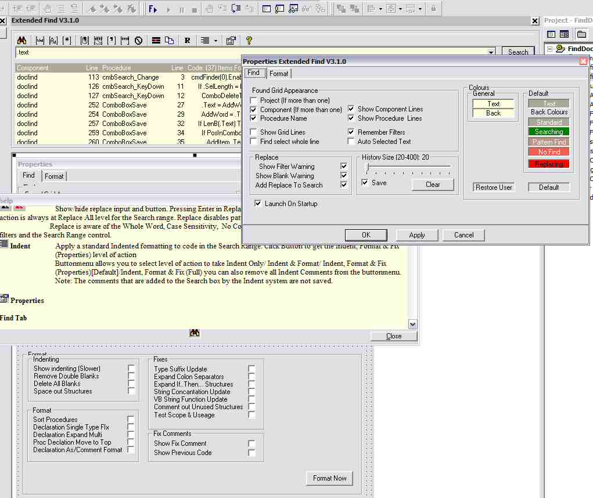



## Extended Find ver 3\.1\.4

### Description

Update of my Extended Find add-in. It is a more friendly interface than VB's own Find and Replace tool. Now has a basic indented formatter. Indent code at project, module, procedure or selected text level. Couple of options for treatment of blank lines. Bug in Replace fixed.

----

If the formatter fails it inserts an error message( 'Indent Error ). This means either that your code is missing some vital line, OR you have used a legal but rare layout that I didn't know, OR as the formatter is a 'rewrite from ground up experiment', it has a bug. If you think your error is one of the last two please let me know and send copy of procedure that produced error.

----

ver 3.1.4

Lots more Formatting/Fixes. Added Button-menu to allow quick access to common sub-sets of formatting.

NOTE: Indent/Format now powerful enough to be dangerous. Will add backup protection next.

ver 3.1.1

small bug with line continuation and Declare fixed.

ver 3.1

Fixed bug with line continuation in procedure heads. Added more formatting options.
 
### More Info
 

             |
---                |---
**Submitted On**   |2003-07-30 13:44:50
**By**             |[Roger Gilchrist](https://github.com/Planet-Source-Code/PSCIndex/blob/master/ByAuthor/roger-gilchrist.md)
**Level**          |Advanced
**User Rating**    |4.8 (53 globes from 11 users)
**Compatibility**  |VB 6\.0
**Category**       |[Complete Applications](https://github.com/Planet-Source-Code/PSCIndex/blob/master/ByCategory/complete-applications__1-27.md)
**World**          |[Visual Basic](https://github.com/Planet-Source-Code/PSCIndex/blob/master/ByWorld/visual-basic.md)
**Archive File**   |[Extended\_F162249812003\.zip](https://github.com/Planet-Source-Code/roger-gilchrist-extended-find-ver-3-1-4__1-46973/archive/master.zip)

